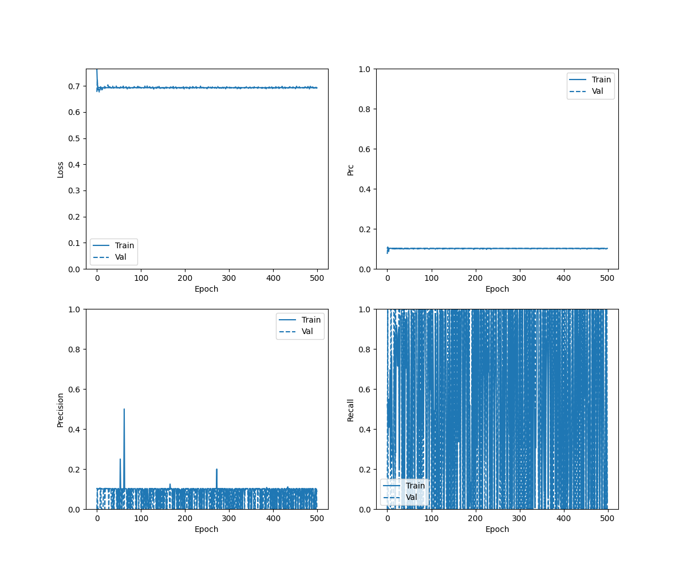
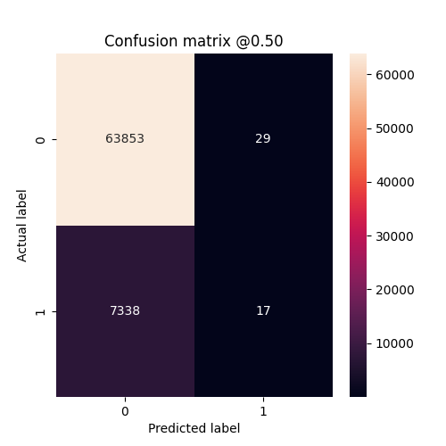
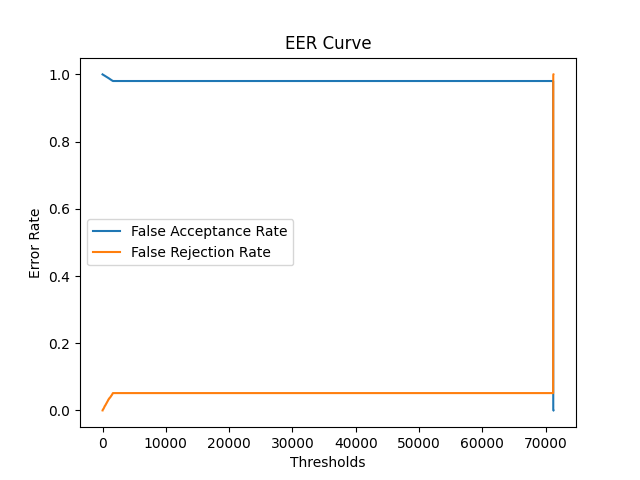
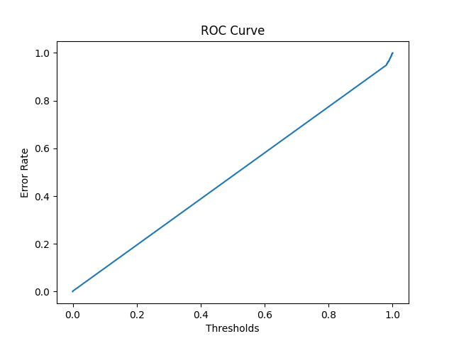

## Cases 
- Using New LFCC Features
- Trained upto 500 epochs
- Alpha = 0.6 for ELTP


## Checkpoints
```./checkpoints/eltp_lfcc_new/checkpoint```
## Result
- Unable to converge

### History Curve


### Confusion Matrix 



### EER Curve 



### ROC Curve

