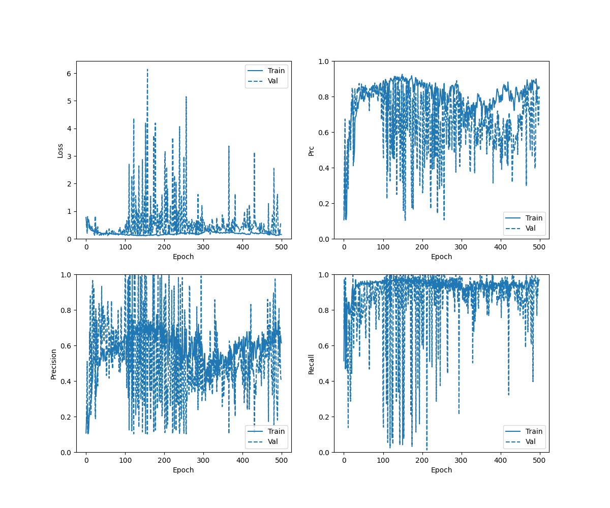
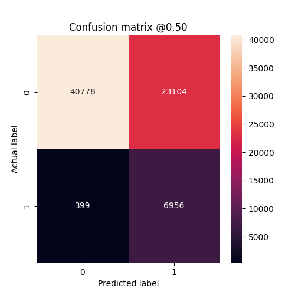
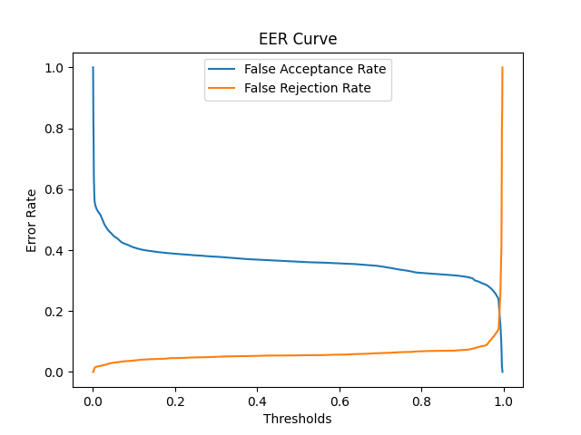
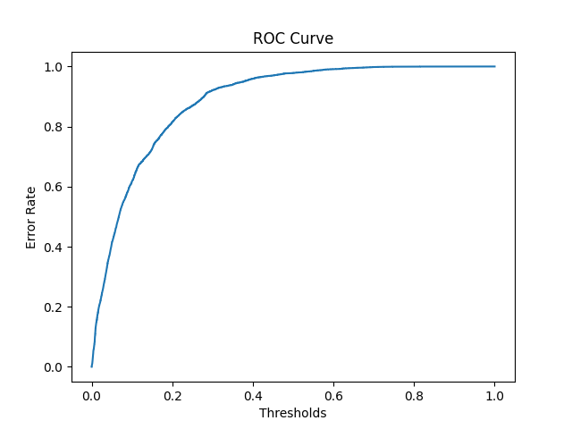

## Cases 
- Using LFCC Features and ELTP Features
- Trained upto 500 epochs
- Alpha = 0.8 for ELTP


## Checkpoints 
```./checkpoints/eltp_lfcc_500_alpha_80/checkpoint```

## Result
- Locally Converge but not able to converge globally
- accuracy :  0.7180398106575012
- precision :  0.24508430063724518
- recall :  0.8320870399475098
- auc :  0.8238363265991211
- prc :  0.2991851568222046

### History Curve



### Confusion Matrix 



### EER Curve 



### ROC Curve

