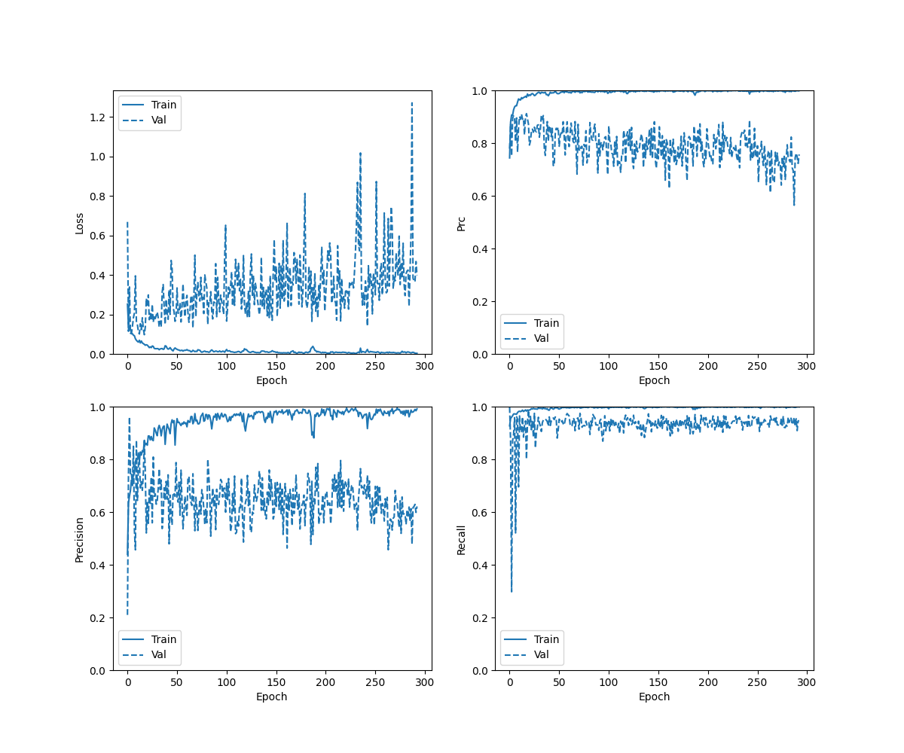
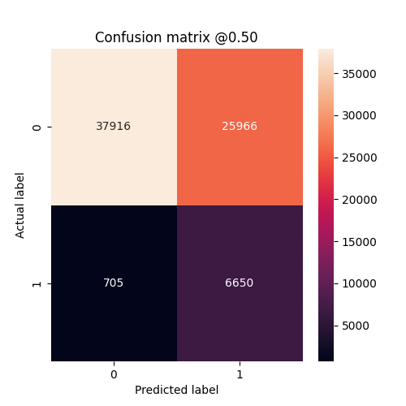
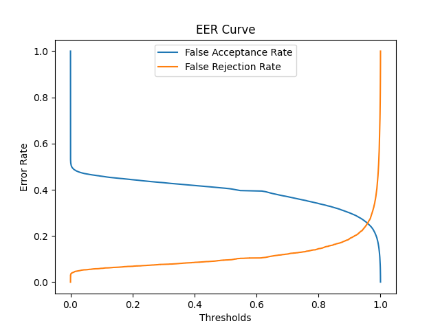
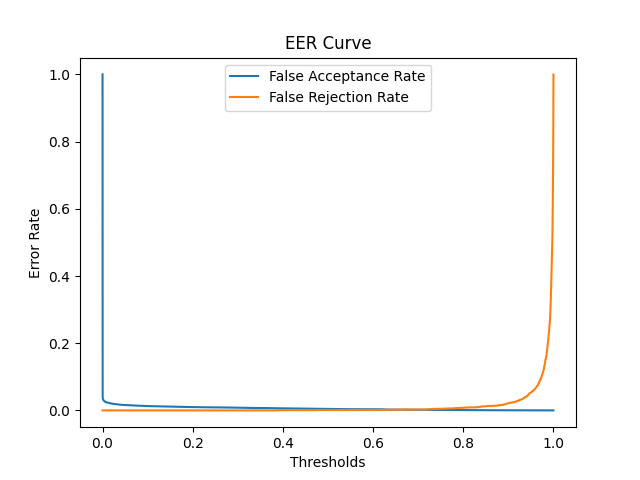
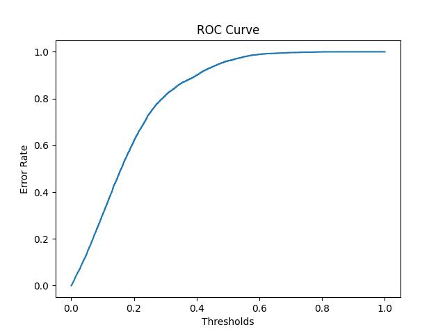

## Cases 
- Using LFCC Features and ELTP Features
- Trained upto 500 epochs
- Alpha = 0.8 for ELTP
- Only one BiLSTM layer 


## Checkpoints 
```./checkpoints/eltp_lfcc_500_alpha_80_single_bilstm/checkpoint```

## Result
- Locally Converge but not able to converge globally
- Over fitting. Very High accuracy for Train data and EER for train data is as low as 0.01 %
- accuracy :  0.6256018877029419
- precision :  0.20388765633106232
- recall :  0.9041468501091003
- auc :  0.8044865727424622
- prc :  0.24900776147842407

### History Curve



### Confusion Matrix 



### EER Curve for Eval Data



### EER Curve for Dev Data
<!--  -->


### EER Curve for Train Data



### ROC Curve

