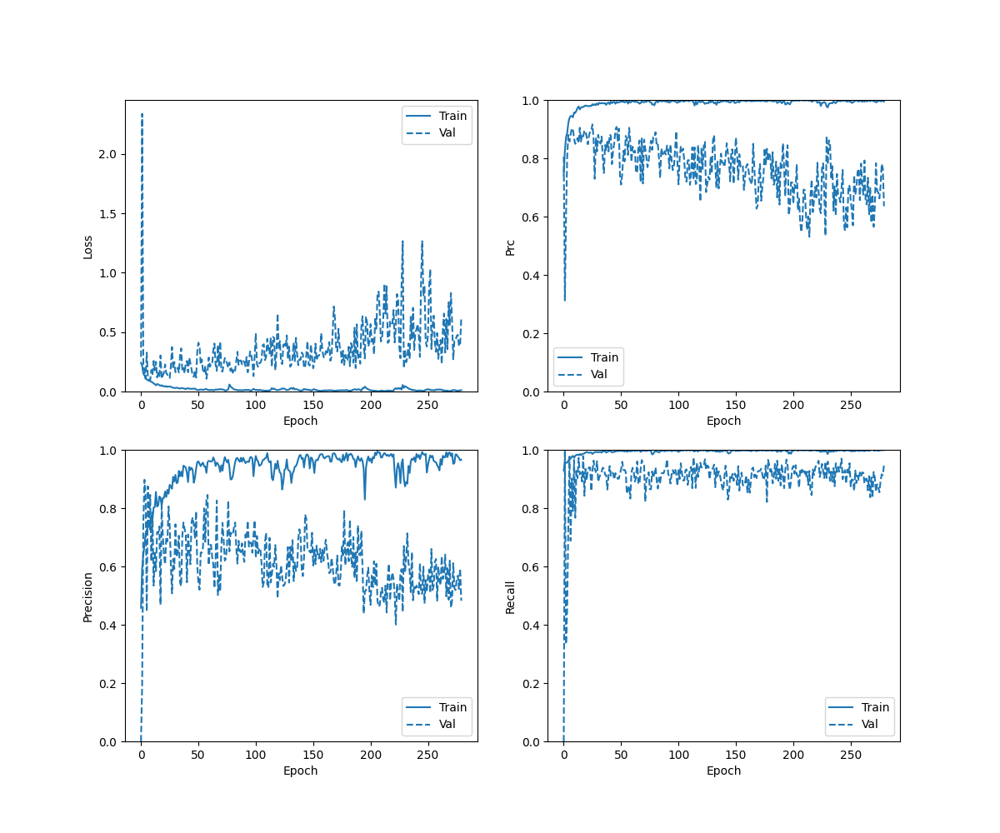
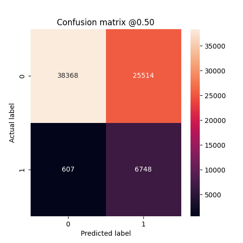
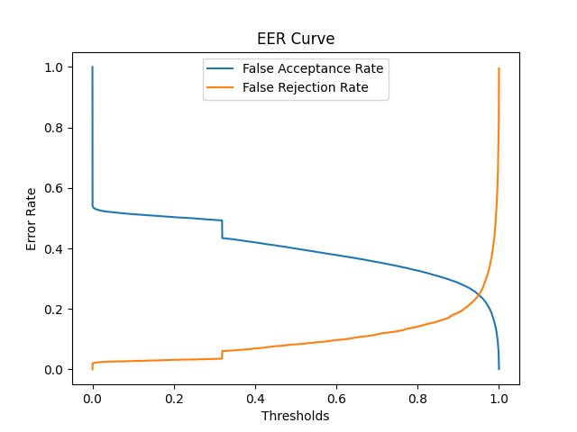
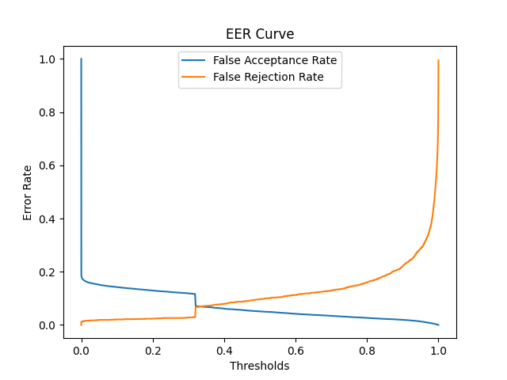
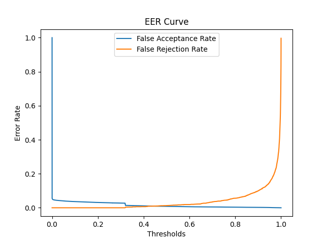
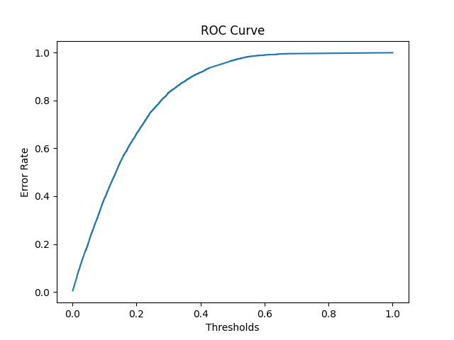

## Cases 
- Using LFCC Features and ELTP Features
- Trained upto 500 epochs
- Alpha = 0.4 for ELTP
- Only one BiLSTM layer 


## Checkpoints 
```./checkpoints/eltp_lfcc_500_alpha_40_single_bilstm/checkpoint```

## Result on Eval Data
- Locally Converge but not able to converge globally
- Over fitting. Very High accuracy for Train data and EER for train data is as low as 0.01 %
- accuracy :  0.6333225965499878
- precision :  0.20916248857975006
- recall :  0.9174711108207703
- auc :  0.8243493437767029
- prc :  0.2770080268383026

## Result on Dev Data
- accuracy :  0.9444534182548523
- precision :  0.6699650883674622
- recall :  0.9034537076950073
- auc :  0.9779611229896545
- prc :  0.876754879951477


## Result on Train Data
- accuracy :  0.9914105534553528
- precision :  0.9322840571403503
- recall :  0.9872093200683594
- auc :  0.9992474913597107
- prc :  0.9924324750900269


### History Curve



### Confusion Matrix 



### EER Curve for Eval Data



### EER Curve for Dev Data



### EER Curve for Train Data



### ROC Curve

