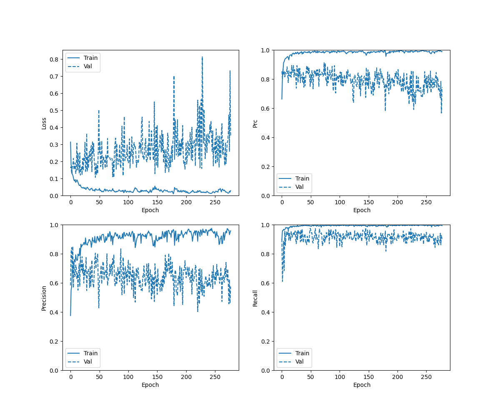
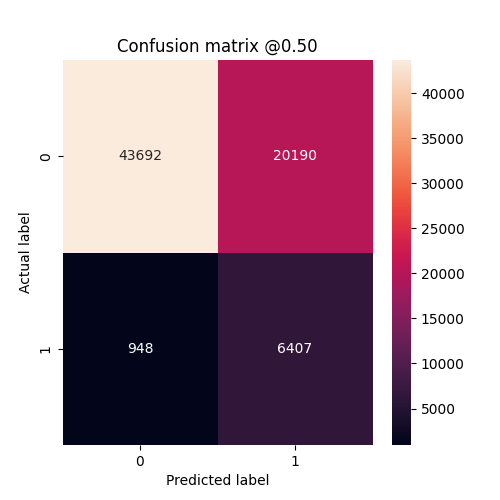
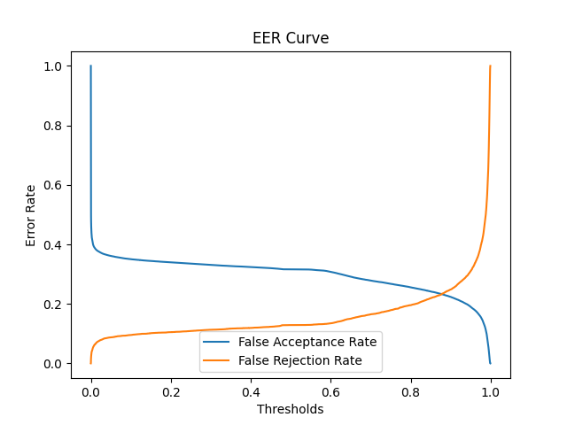
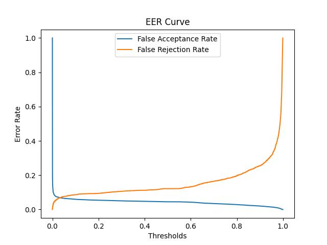
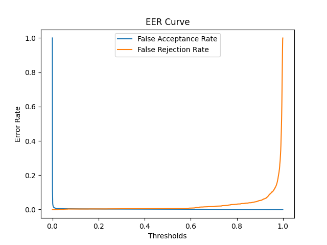
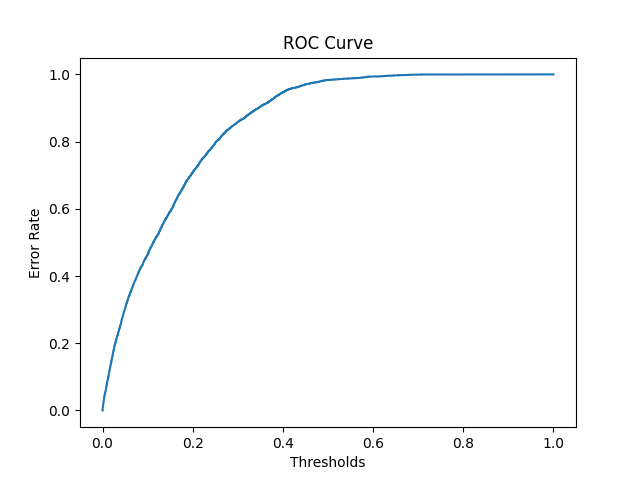
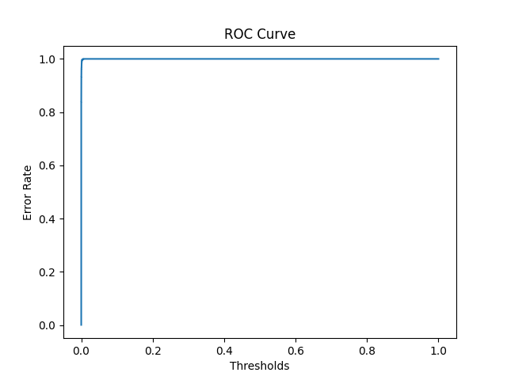

## Cases 
- Using LFCC Features and ELTP Features
- Trained upto 500 epochs
- Alpha = 0.4 for ELTP
- two BiLSTM layer 


## Checkpoints 
```./checkpoints/eltp_lfcc_500_alpha_40_double_bilstm/checkpoint```

## Result on Eval Data
- Locally Converge but not able to converge globally
- Over fitting. Very High accuracy for Train qq and EER for train data is as low as 0.01 %
- accuracy :  0.7032721638679504
- precision :  0.24089182913303375
- recall :  0.8711081147193909
- auc :  0.8397614359855652
- prc :  0.33090004324913025
- Equal Error Rate:  0.23283554052784822  at thresholds:  0.8775277733802795

## Result on Dev Data
- accuracy :  0.9472709894180298
- precision :  0.6910493969917297
- recall :  0.8787283897399902
- auc :  0.9662288427352905
- prc :  0.8509402275085449
- Equal Error Rate:  0.0686670254754216  at thresholds:  0.03256692737340927

## Result on Train Data
- accuracy :  0.9978329539299011
- precision :  0.9850172996520996
- recall :  0.9937984347343445
- auc :  0.9998976588249207
- prc :  0.9990108013153076
- Equal Error Rate:  0.0030701754385964912  at thresholds:  0.1580309420824051

### History Curve



### Confusion Matrix 



### EER Curve for Eval Data



### EER Curve for Dev Data



### EER Curve for Train Data



### ROC Curve



### ROC Curve for Train

