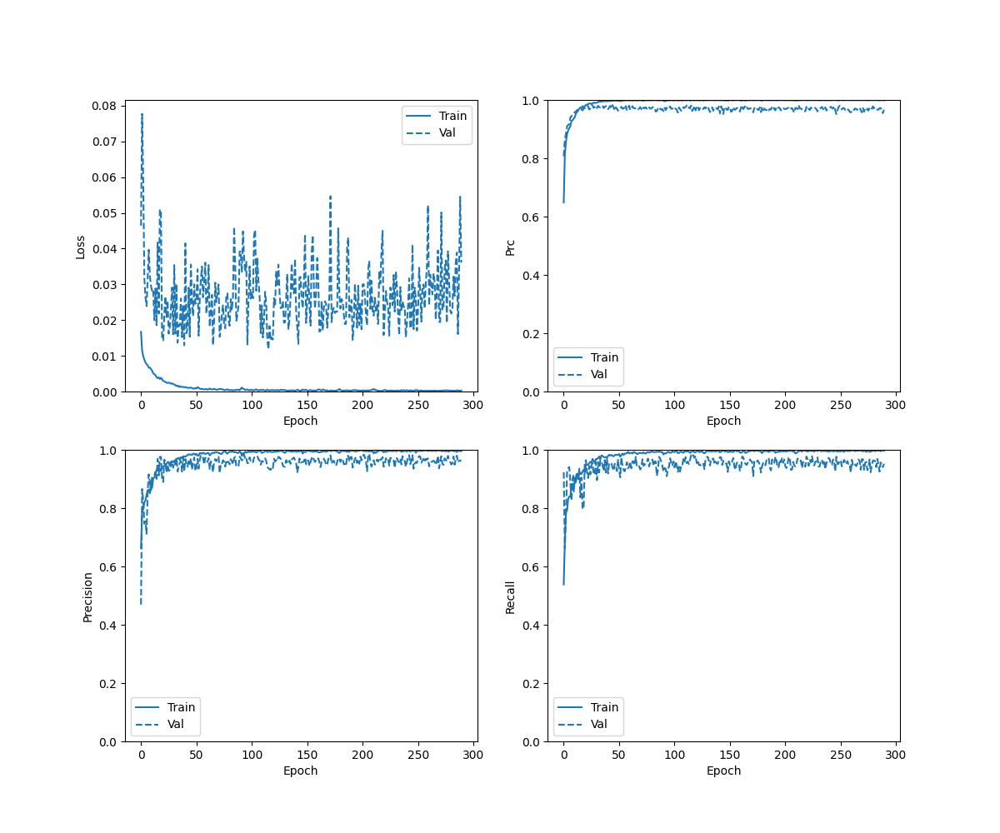

## Cases 
- Using LFCC Features and ALDP Features
- Trained upto 500 epochs early stopping at 290
- Alpha = 0.4 for ALDP
- two BiLSTM layer with 64 hidden layerse


## Checkpoints 
```./checkpoints/aldp_lfcc_500_double_bilstm_2_weighted_binary_cross_entropy/checkpoint```

## Result on Eval Data
- Locally Converge but not able to converge globally
- Over fitting. Very High accuracy for Train qq and EER for train data is as low as 0.01 %
- accuracy :  0.7183766961097717
- precision :  0.2551354765892029
- recall :  0.9000679850578308
- auc :  0.8472141027450562
- prc :  0.30430227518081665
- Equal Error Rate:  0.20282708744247205  at thresholds:  0.9915010929107666

## Result on Dev Data
- accuracy :  0.9978264570236206
- precision :  0.9848366975784302
- recall :  0.994113028049469
- auc :  0.998996913433075
- prc :  0.9953576326370239
- Equal Error Rate:  0.0035432364549695013  at thresholds:  0.08875405788421631

## Result on Train Data
- accuracy :  0.9977935552597046
- precision :  0.9838957190513611
- recall :  0.9945736527442932
- auc :  0.998573362827301
- prc :  0.99405837059021
- Equal Error Rate:  0.0038596491228070177  at thresholds:  0.11707477271556854

### History Curve



### Confusion Matrix 


### EER Curve for Eval Data


### EER Curve for Dev Data


### EER Curve for Train Data


### ROC Curve


### ROC Curve for Train

