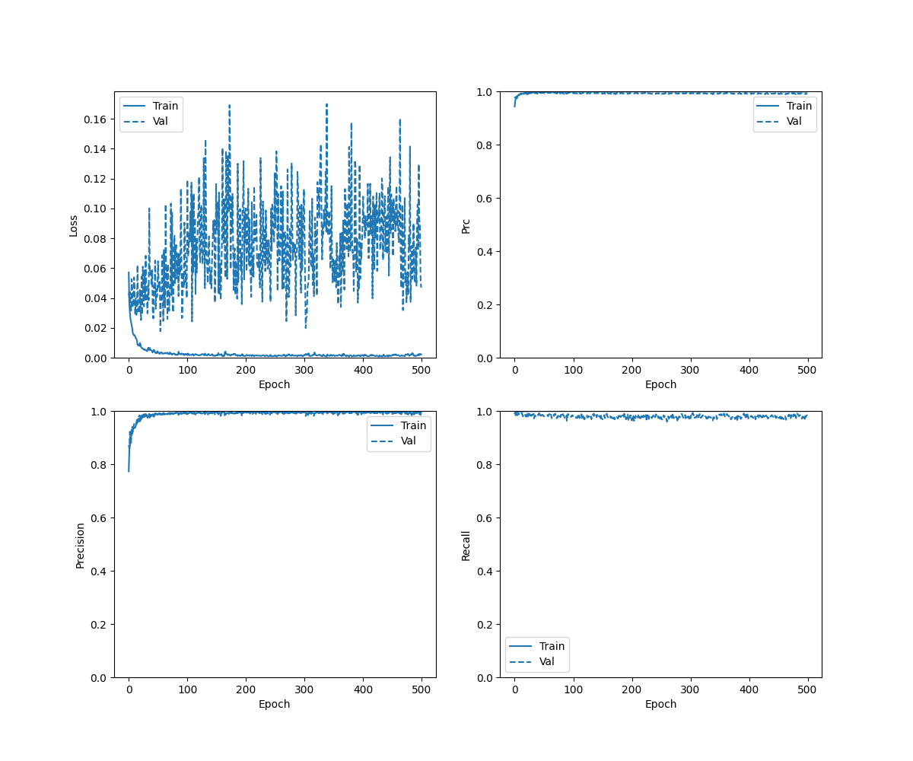
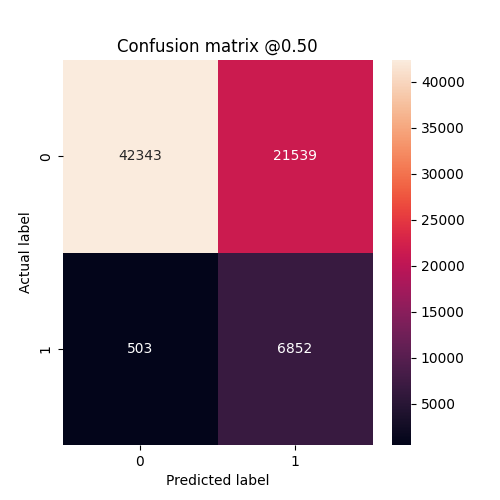
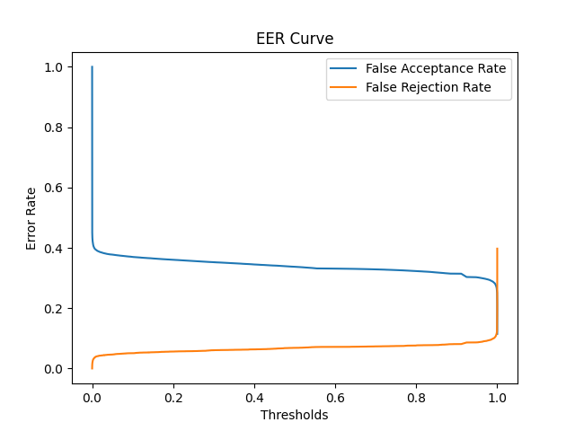
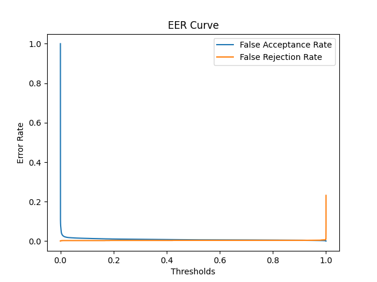
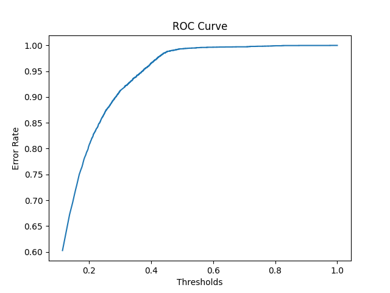
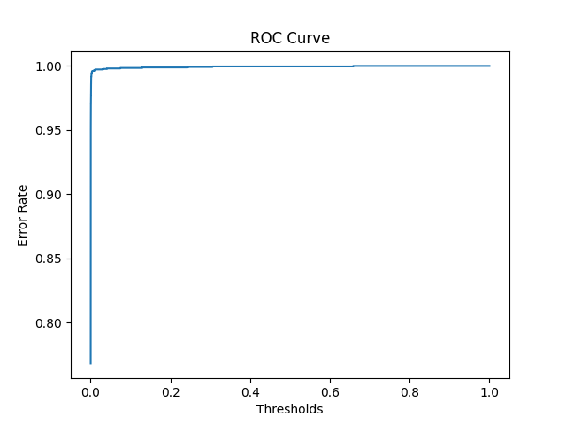

## Cases 
- Using LFCC Features and ALDP Features
- Trained upto 500 epochs 
- Alpha = 0.4 for ALDP
- two BiLSTM layer with 64 hidden layerse
- Bootstraping for Pseudo Balanced Datasets


## Checkpoints 
```./checkpoints/aldp_lfcc_500_double_bilstm_2_weighted_binary_cross_entropy_using_Bootstrap/checkpoint```

## Result on Eval Data
- 
- accuracy :  0.6905821561813354
- precision :  0.24134409427642822
- recall :  0.9316111207008362
- auc :  0.8267630338668823
- prc :  0.262868732213974
- Equal Error Rate:  0.19808396731473654  at thresholds:  0.9999922513961792

## Result on Dev Data
- accuracy :  0.9958139061927795
- precision :  0.9639331698417664
- recall :  0.9964678287506104
- auc :  0.998612105846405
- prc :  0.9825662970542908
- Equal Error Rate:  0.004260853964836742  at thresholds:  0.5051431655883789

## Result on Train Data
- accuracy :  0.9935775995254517
- precision :  0.9438119530677795
- recall :  0.9961240291595459
- auc :  0.9976086020469666
- prc :  0.9778520464897156
- Equal Error Rate:  0.0037280701754385964  at thresholds:  0.9510853290557861

### History Curve



### Confusion Matrix 



### EER Curve for Eval Data



### EER Curve for Dev Data


### EER Curve for Train Data



### ROC Curve for Eval



### ROC Curve for Train

